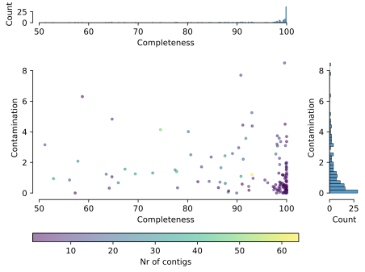
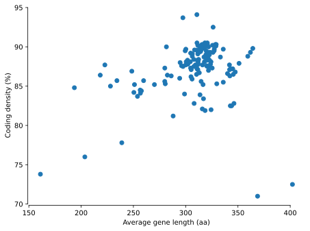

# Analysing MAG quality with checkM2 and Python (using polars)

## Data download

You can download the input MAGs from [Dropbox](https://www.dropbox.com/scl/fo/p3hucjlh0pl8mkaw9uk6x/AM4myQn4fDo8vY45Hur7Exw?rlkey=avptw2w2tc15awpxx4dj0galh&st=8zggisa6&dl=0).

Download the MAGs to a folder called `data/`. If everything is set up correctly, you should be able to run the following command to list the files in the `data/` directory:

```bash
ls data/
```

and the output should look like this (only the first few lines are shown here):

```
SHD1_0000.fna.gz
SHD1_0020.fna.gz
SHD1_0040.fna.gz
SHD1_0060.fna.gz
SHD1_0080.fna.gz
SHD1_0100.fna.gz
SHD1_0120.fna.gz
...
```

## Requirements

Install [pixi](https://pixi.sh/), which will install all the required dependencies, including `checkm2`.

## Running the analysis

Step 1: run checkM2 on the MAGs

```bash
jug execute run_checkm2.py
```

Step 2: run the plotting script

```bash
python quality_figures.py
```

Which will generate the following figures

### Overall quality of the MAGs



### Coding density vs. gene size



## LICENSE

This project is licensed under the MIT License - see the [COPYING.MIT](COPYING.MIT) file for details.

